# 프로젝트 상세 다이어그램 모음

이 문서는 현재 코드베이스를 기준으로 프로젝트를 여러 관점에서 시각화한 상세 다이어그램 모음이다.

- 생성 기준일: `2026-04-15`
- 기준 소스: `main.c`, `sql.c`, `table.c`, `bptree.c`, `unit_test.c`, `perf_test.c`, `Makefile`
- 포함 다이어그램: Mermaid 다이어그램 `19개`
- 검증 결과:
  - `2026-04-15` 실행 `./unit_test` -> `All unit tests passed.`
  - `2026-04-15` 실행 `./perf_test` -> `1,000,000`건 기준 `B+ Tree 9.913ms`, `Linear 12353.667ms`, `1246.20x`

## 빠른 사실 요약

| 항목 | 내용 |
| --- | --- |
| 언어/빌드 | C11, `-Wall -Wextra -Werror -pedantic -O2` |
| 저장 방식 | 단일 메모리 테이블 |
| 스키마 | `users(id, name, age)` |
| 인덱스 | `id`에만 B+ 트리 인덱스 |
| 비인덱스 조회 | `name`, `age`는 선형 탐색 |
| B+ 트리 차수 | `BPTREE_ORDER = 4` |
| 노드 최대 key 수 | `3` |
| 지원 SQL | `INSERT`, `SELECT *`, `SELECT ... WHERE id/name/age`, `EXIT/QUIT` |
| 미지원 | `DELETE`, `UPDATE`, `JOIN`, `GROUP BY`, 범용 SQL 파싱, 디스크 저장 |

## 1. 전체 시스템 컨텍스트

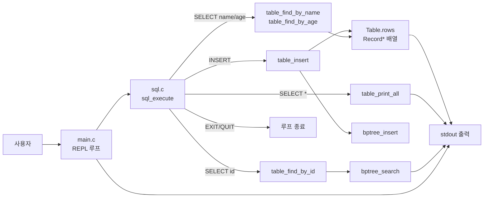
```mermaid
flowchart LR
    User["사용자"] --> REPL["main.c<br/>REPL 루프"]
    REPL --> SQL["sql.c<br/>sql_execute"]

    SQL -->|"INSERT"| Insert["table_insert"]
    SQL -->|"SELECT *"| PrintAll["table_print_all"]
    SQL -->|"SELECT id"| FindById["table_find_by_id"]
    SQL -->|"SELECT name/age"| ScanField["table_find_by_name<br/>table_find_by_age"]
    SQL -->|"EXIT/QUIT"| Exit["루프 종료"]

    Insert --> Rows["Table.rows<br/>Record* 배열"]
    Insert --> IndexInsert["bptree_insert"]
    FindById --> IndexSearch["bptree_search"]
    ScanField --> Rows

    Rows --> Output["stdout 출력"]
    PrintAll --> Output
    IndexSearch --> Output
    REPL --> Output
```

핵심 해석:

- 사용자 입력은 항상 `main.c`의 REPL에서 받고, 실행 로직은 `sql_execute()`로 내려간다.
- `INSERT`는 테이블 배열과 B+ 트리 인덱스를 동시에 갱신한다.
- `SELECT id`만 인덱스를 사용하고, `SELECT name/age`는 `rows` 전체를 순회한다.

관련 코드:

- `main.c:9-63`
- `sql.c:143-315`
- `table.c:65-179`
- `bptree.c:288-339`

## 2. 빌드 산출물 의존성

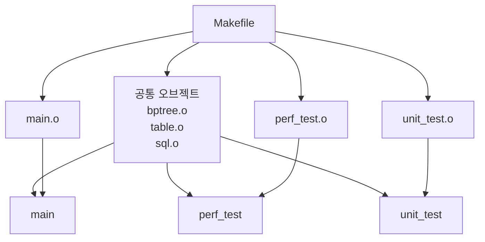
```mermaid
flowchart TB
    Make["Makefile"] --> Common["공통 오브젝트<br/>bptree.o<br/>table.o<br/>sql.o"]
    Make --> MainObj["main.o"]
    Make --> PerfObj["perf_test.o"]
    Make --> TestObj["unit_test.o"]

    Common --> MainExe["main"]
    MainObj --> MainExe

    Common --> PerfExe["perf_test"]
    PerfObj --> PerfExe

    Common --> TestExe["unit_test"]
    TestObj --> TestExe
```

핵심 해석:

- 실행 파일은 `main`, `perf_test`, `unit_test` 세 개다.
- 핵심 비즈니스 로직은 `bptree.c`, `table.c`, `sql.c`에 몰려 있고 세 바이너리가 이를 재사용한다.

관련 코드:

- `Makefile:1-24`

## 3. 런타임 모듈 호출도

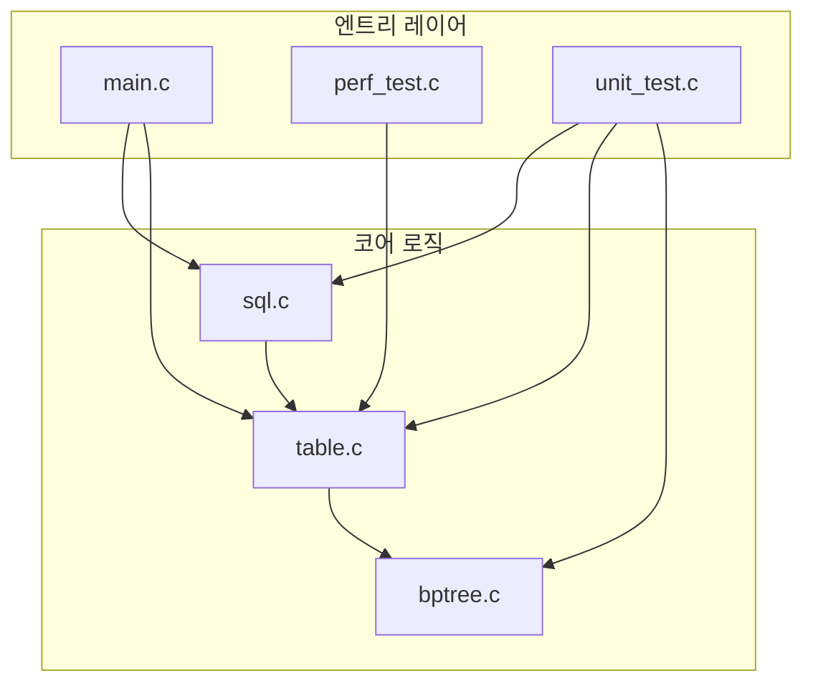
```mermaid
flowchart TB
    subgraph Entry["엔트리 레이어"]
        Main["main.c"]
        Perf["perf_test.c"]
        Test["unit_test.c"]
    end

    subgraph Core["코어 로직"]
        SQL["sql.c"]
        Table["table.c"]
        Tree["bptree.c"]
    end

    Main --> SQL
    Main --> Table

    Perf --> Table

    Test --> SQL
    Test --> Table
    Test --> Tree

    SQL --> Table
    Table --> Tree
```

핵심 해석:

- `sql.c`는 파싱과 실행 분기를 담당하지만 실제 데이터 접근은 `table.c`에 위임한다.
- `table.c`는 데이터 저장소이면서 동시에 B+ 트리 인덱스와 연결되는 중간 계층이다.
- `bptree.c`는 SQL을 모르고 오직 key/value 저장과 탐색만 담당한다.

관련 코드:

- `main.c:1-63`
- `perf_test.c:1-100`
- `unit_test.c:1-236`

## 4. 핵심 데이터 구조 관계도

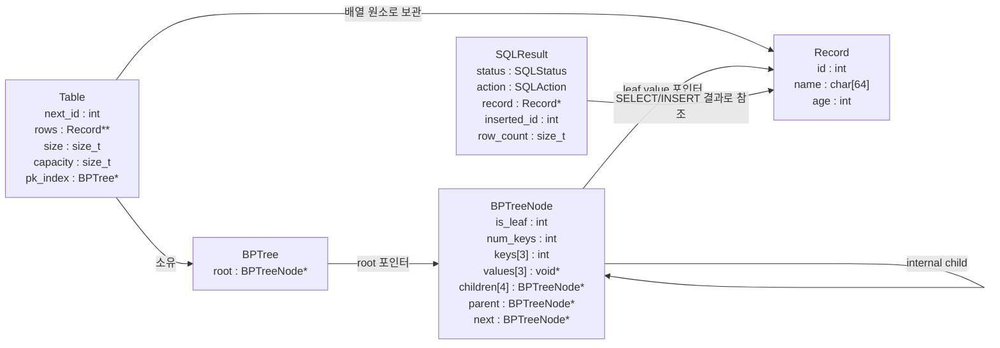
```mermaid
flowchart LR
    Table["Table<br/>next_id : int<br/>rows : Record**<br/>size : size_t<br/>capacity : size_t<br/>pk_index : BPTree*"]
    Record["Record<br/>id : int<br/>name : char[64]<br/>age : int"]
    Tree["BPTree<br/>root : BPTreeNode*"]
    Node["BPTreeNode<br/>is_leaf : int<br/>num_keys : int<br/>keys[3] : int<br/>values[3] : void*<br/>children[4] : BPTreeNode*<br/>parent : BPTreeNode*<br/>next : BPTreeNode*"]
    Result["SQLResult<br/>status : SQLStatus<br/>action : SQLAction<br/>record : Record*<br/>inserted_id : int<br/>row_count : size_t"]

    Table -->|"소유"| Tree
    Table -->|"배열 원소로 보관"| Record
    Tree -->|"root 포인터"| Node
    Node -->|"internal child"| Node
    Node -->|"leaf value 포인터"| Record
    Result -->|"SELECT/INSERT 결과로 참조"| Record
```

핵심 해석:

- 실제 데이터 레코드는 `Table.rows`에 저장된다.
- B+ 트리 리프의 `values[]`는 `Record*`를 가리키지만, 레코드 메모리의 소유권은 트리가 아니라 `Table`에 있다.
- `SQLResult`는 실행 결과를 외부에 전달하는 얇은 전달 객체다.

관련 코드:

- `table.h:1-44`
- `bptree.h:1-25`
- `sql.h:1-34`

## 5. REPL 제어 루프와 출력 분기

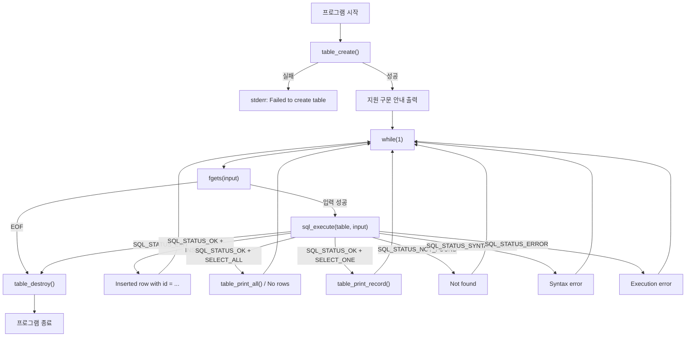
```mermaid
flowchart TD
    Start["프로그램 시작"] --> Create["table_create()"]
    Create -->|"실패"| Fail["stderr: Failed to create table"]
    Create -->|"성공"| Prompt["지원 구문 안내 출력"]
    Prompt --> Loop["while(1)"]

    Loop --> Read["fgets(input)"]
    Read -->|"EOF"| Destroy["table_destroy()"]
    Read -->|"입력 성공"| Exec["sql_execute(table, input)"]

    Exec -->|"SQL_STATUS_EXIT"| Destroy
    Exec -->|"SQL_STATUS_OK + INSERT"| OutInsert["Inserted row with id = ..."]
    Exec -->|"SQL_STATUS_OK + SELECT_ALL"| PrintAll["table_print_all() / No rows"]
    Exec -->|"SQL_STATUS_OK + SELECT_ONE"| PrintOne["table_print_record()"]
    Exec -->|"SQL_STATUS_NOT_FOUND"| NotFound["Not found"]
    Exec -->|"SQL_STATUS_SYNTAX_ERROR"| Syntax["Syntax error"]
    Exec -->|"SQL_STATUS_ERROR"| Error["Execution error"]

    OutInsert --> Loop
    PrintAll --> Loop
    PrintOne --> Loop
    NotFound --> Loop
    Syntax --> Loop
    Error --> Loop
    Destroy --> End["프로그램 종료"]
```

핵심 해석:

- `main.c`는 상태 코드와 액션 코드를 조합해 사용자 출력 문구를 결정한다.
- SQL 파서와 테이블 레이어는 stdout 포맷을 거의 모르고, 최종 메시지는 REPL이 조립한다.

관련 코드:

- `main.c:9-63`

## 6. SQL 디스패치 구조

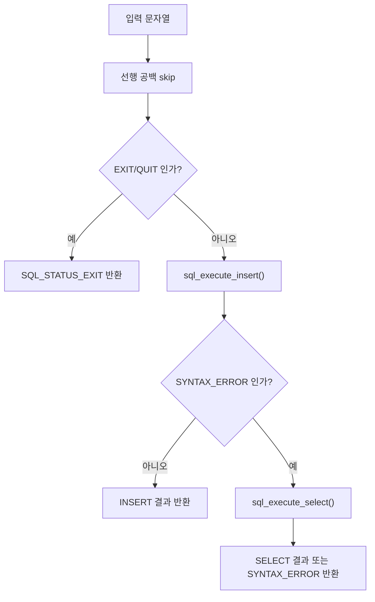
```mermaid
flowchart TD
    Input["입력 문자열"] --> Trim["선행 공백 skip"]
    Trim --> ExitCheck{"EXIT/QUIT 인가?"}

    ExitCheck -->|"예"| Exit["SQL_STATUS_EXIT 반환"]
    ExitCheck -->|"아니오"| TryInsert["sql_execute_insert()"]

    TryInsert --> InsertStatus{"SYNTAX_ERROR 인가?"}
    InsertStatus -->|"아니오"| InsertReturn["INSERT 결과 반환"]
    InsertStatus -->|"예"| TrySelect["sql_execute_select()"]

    TrySelect --> SelectReturn["SELECT 결과 또는 SYNTAX_ERROR 반환"]
```

핵심 해석:

- 이 프로젝트는 범용 파서가 아니라 고정 패턴 파서다.
- `INSERT`를 먼저 시도하고, 그 결과가 문법 오류일 때만 `SELECT` 경로를 탄다.
- `EXIT`, `QUIT`은 가장 앞에서 별도 처리한다.

관련 코드:

- `sql.c:292-315`

## 7. 지원 SQL 구문 분기 구조

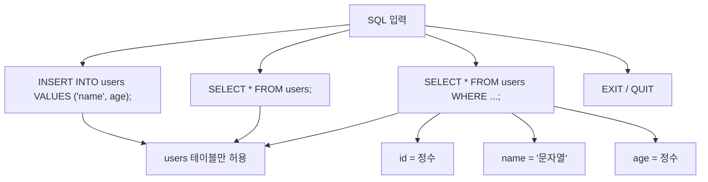
```mermaid
flowchart TD
    SQL["SQL 입력"] --> Insert["INSERT INTO users VALUES ('name', age);"]
    SQL --> SelectAll["SELECT * FROM users;"]
    SQL --> SelectWhere["SELECT * FROM users WHERE ...;"]
    SQL --> Exit["EXIT / QUIT"]

    SelectWhere --> ById["id = 정수"]
    SelectWhere --> ByName["name = '문자열'"]
    SelectWhere --> ByAge["age = 정수"]

    Insert --> TableOnly["users 테이블만 허용"]
    SelectAll --> TableOnly
    SelectWhere --> TableOnly
```

핵심 해석:

- 대상 테이블은 오직 `users` 하나다.
- `WHERE` 절은 `id`, `name`, `age` 3개 컬럼만 허용된다.
- 세미콜론은 optional이지만 trailing garbage는 허용되지 않는다.

관련 코드:

- `sql.c:143-289`

## 8. INSERT 처리 시퀀스

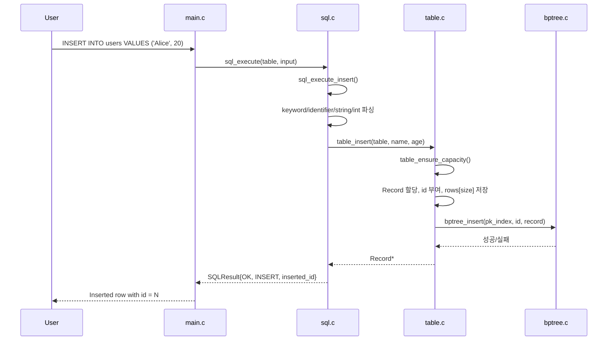
```mermaid
sequenceDiagram
    participant U as User
    participant M as main.c
    participant S as sql.c
    participant T as table.c
    participant B as bptree.c

    U->>M: INSERT INTO users VALUES ('Alice', 20);
    M->>S: sql_execute(table, input)
    S->>S: sql_execute_insert()
    S->>S: keyword/identifier/string/int 파싱
    S->>T: table_insert(table, name, age)
    T->>T: table_ensure_capacity()
    T->>T: Record 할당, id 부여, rows[size] 저장
    T->>B: bptree_insert(pk_index, id, record)
    B-->>T: 성공/실패
    T-->>S: Record*
    S-->>M: SQLResult{OK, INSERT, inserted_id}
    M-->>U: Inserted row with id = N
```

핵심 해석:

- 삽입 성공의 기준은 레코드 메모리 확보와 인덱스 삽입까지 모두 끝나는 것이다.
- `id`는 입력받지 않고 `Table.next_id`에서 자동 증가한다.
- 인덱스 삽입 실패 시 `table_insert()`는 `NULL`을 반환한다.

관련 코드:

- `sql.c:144-210`
- `table.c:65-96`
- `bptree.c:288-321`

## 9. SELECT WHERE id 처리 시퀀스

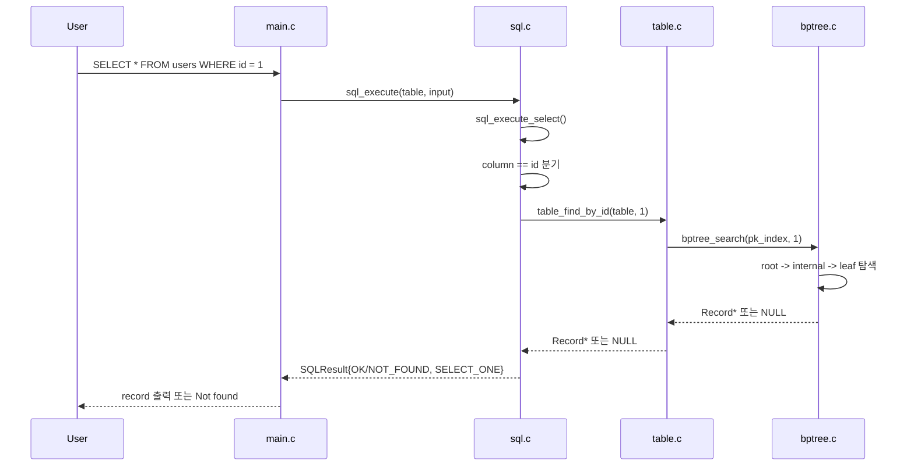
```mermaid
sequenceDiagram
    participant U as User
    participant M as main.c
    participant S as sql.c
    participant T as table.c
    participant B as bptree.c

    U->>M: SELECT * FROM users WHERE id = 1;
    M->>S: sql_execute(table, input)
    S->>S: sql_execute_select()
    S->>S: column == id 분기
    S->>T: table_find_by_id(table, 1)
    T->>B: bptree_search(pk_index, 1)
    B->>B: root -> internal -> leaf 탐색
    B-->>T: Record* 또는 NULL
    T-->>S: Record* 또는 NULL
    S-->>M: SQLResult{OK/NOT_FOUND, SELECT_ONE}
    M-->>U: record 출력 또는 Not found
```

핵심 해석:

- `id` 조회만 유일하게 인덱스 경로를 타며 평균적으로 가장 빠르다.
- SQL 레이어는 `id`가 정수인지 확인한 뒤 검색 전략을 결정한다.

관련 코드:

- `sql.c:214-288`
- `table.c:99-105`
- `bptree.c:29-50`
- `bptree.c:325-339`

## 10. SELECT WHERE name/age 처리 시퀀스

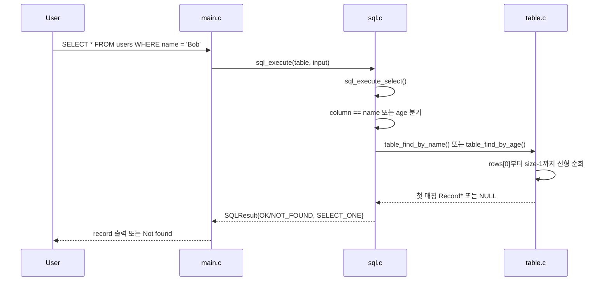
```mermaid
sequenceDiagram
    participant U as User
    participant M as main.c
    participant S as sql.c
    participant T as table.c

    U->>M: SELECT * FROM users WHERE name = 'Bob';
    M->>S: sql_execute(table, input)
    S->>S: sql_execute_select()
    S->>S: column == name 또는 age 분기
    S->>T: table_find_by_name() 또는 table_find_by_age()
    T->>T: rows[0]부터 size-1까지 선형 순회
    T-->>S: 첫 매칭 Record* 또는 NULL
    S-->>M: SQLResult{OK/NOT_FOUND, SELECT_ONE}
    M-->>U: record 출력 또는 Not found
```

핵심 해석:

- `name`, `age`는 별도 인덱스가 없어서 항상 첫 레코드부터 끝까지 비교한다.
- 동일 값이 여러 개 있어도 첫 번째 매칭 하나만 반환한다.

관련 코드:

- `sql.c:268-280`
- `table.c:124-156`

## 11. `table_insert()` 내부 데이터 경로

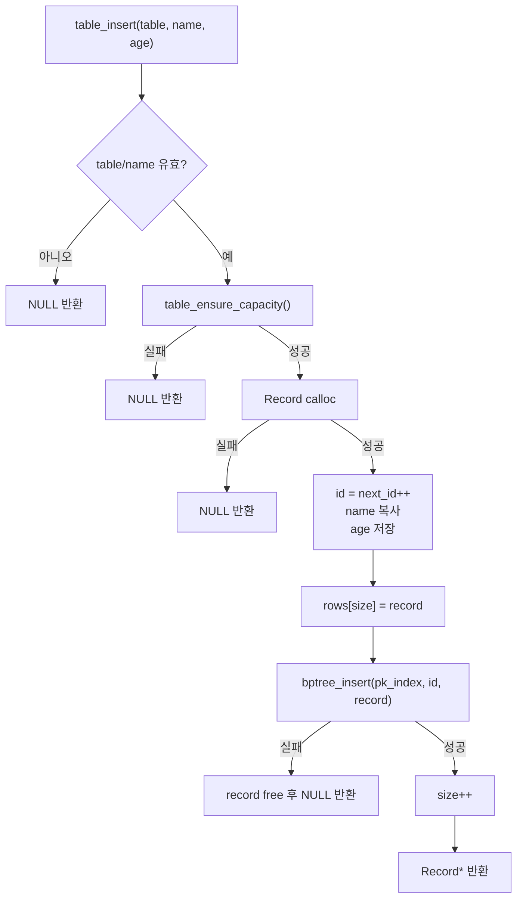
```mermaid
flowchart TD
    Start["table_insert(table, name, age)"] --> Valid{"table/name 유효?"}
    Valid -->|"아니오"| Fail0["NULL 반환"]
    Valid -->|"예"| Capacity["table_ensure_capacity()"]

    Capacity -->|"실패"| Fail1["NULL 반환"]
    Capacity -->|"성공"| Alloc["Record calloc"]

    Alloc -->|"실패"| Fail2["NULL 반환"]
    Alloc -->|"성공"| Fill["id = next_id++<br/>name 복사<br/>age 저장"]
    Fill --> Save["rows[size] = record"]
    Save --> Index["bptree_insert(pk_index, id, record)"]

    Index -->|"실패"| Rollback["record free 후 NULL 반환"]
    Index -->|"성공"| Commit["size++"]
    Commit --> Ok["Record* 반환"]
```

핵심 해석:

- 배열 저장은 인덱스 삽입보다 먼저 이뤄지지만, `size++`는 인덱스 성공 후에만 수행된다.
- 따라서 실패 시 `rows[size]` 자리에 dangling raw pointer는 남지 않지만, 증가되지 않은 `size` 덕분에 논리적으로는 무시된다.

관련 코드:

- `table.c:65-96`

## 12. B+ 트리 검색 알고리즘

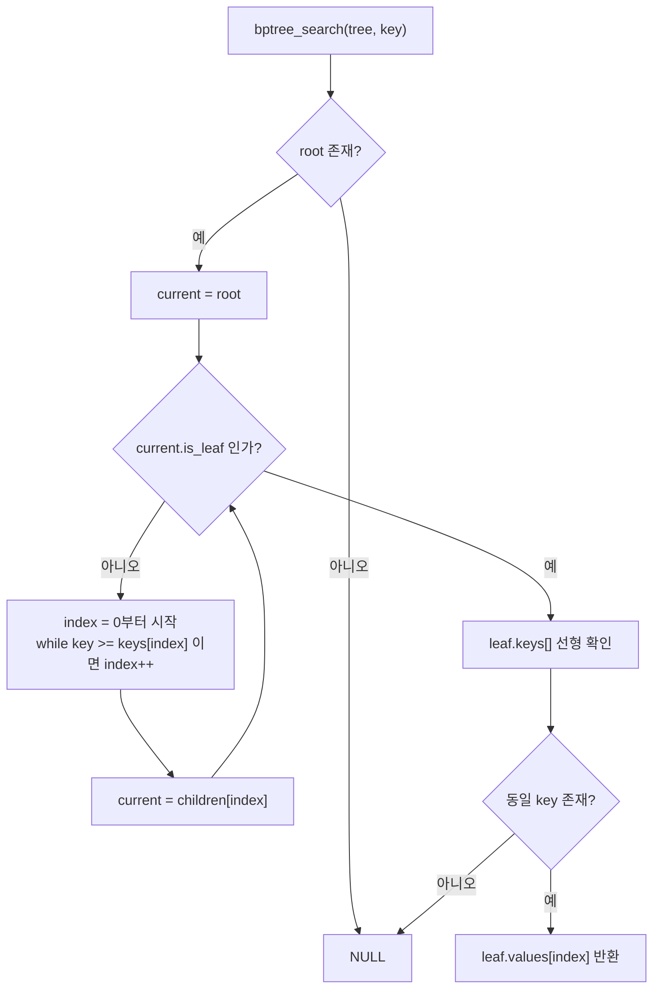
```mermaid
flowchart TD
    Start["bptree_search(tree, key)"] --> Root{"root 존재?"}
    Root -->|"아니오"| Null["NULL"]
    Root -->|"예"| Current["current = root"]

    Current --> LeafCheck{"current.is_leaf 인가?"}
    LeafCheck -->|"아니오"| Pick["index = 0부터 시작<br/>while key >= keys[index] 이면 index++"]
    Pick --> Child["current = children[index]"]
    Child --> LeafCheck

    LeafCheck -->|"예"| Scan["leaf.keys[] 선형 확인"]
    Scan --> Match{"동일 key 존재?"}
    Match -->|"예"| Value["leaf.values[index] 반환"]
    Match -->|"아니오"| Null
```

핵심 해석:

- 내부 노드에서는 `key >= separator` 조건으로 오른쪽 child를 선택한다.
- 최종 leaf에 도착한 뒤에도 leaf 내부 key 배열을 한 번 더 선형 확인한다.

관련 코드:

- `bptree.c:29-50`
- `bptree.c:325-339`

## 13. 리프 노드 split 상세도

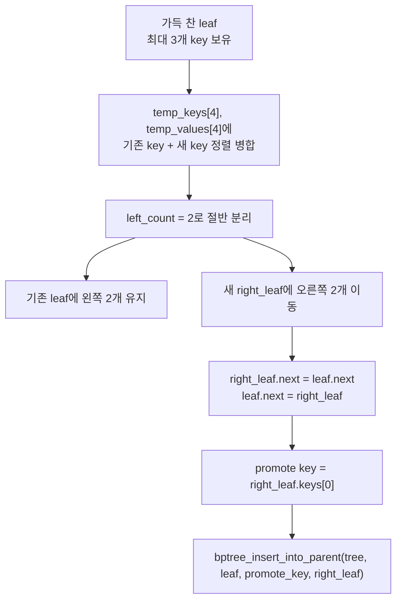
```mermaid
flowchart TD
    FullLeaf["가득 찬 leaf<br/>최대 3개 key 보유"] --> Merge["temp_keys[4], temp_values[4]에<br/>기존 key + 새 key 정렬 병합"]
    Merge --> Split["left_count = 2로 절반 분리"]
    Split --> Left["기존 leaf에 왼쪽 2개 유지"]
    Split --> Right["새 right_leaf에 오른쪽 2개 이동"]
    Right --> Link["right_leaf.next = leaf.next<br/>leaf.next = right_leaf"]
    Link --> Promote["promote key = right_leaf.keys[0]"]
    Promote --> Parent["bptree_insert_into_parent(tree, leaf, promote_key, right_leaf)"]
```

구체 예시:

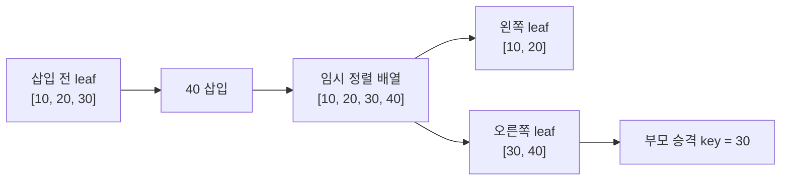
```mermaid
flowchart LR
    Before["삽입 전 leaf<br/>[10, 20, 30]"] --> Insert["40 삽입"]
    Insert --> Temp["임시 정렬 배열<br/>[10, 20, 30, 40]"]
    Temp --> Left["왼쪽 leaf<br/>[10, 20]"]
    Temp --> Right["오른쪽 leaf<br/>[30, 40]"]
    Right --> Promote["부모 승격 key = 30"]
```

핵심 해석:

- 이 구현은 `BPTREE_ORDER / 2`를 기준으로 정확히 `2 | 2` 분할한다.
- 리프 간 `next` 포인터를 보존해서 향후 range scan 확장이 가능한 구조를 유지한다.

관련 코드:

- `bptree.c:147-199`

## 14. 내부 노드 split 및 승격 전파

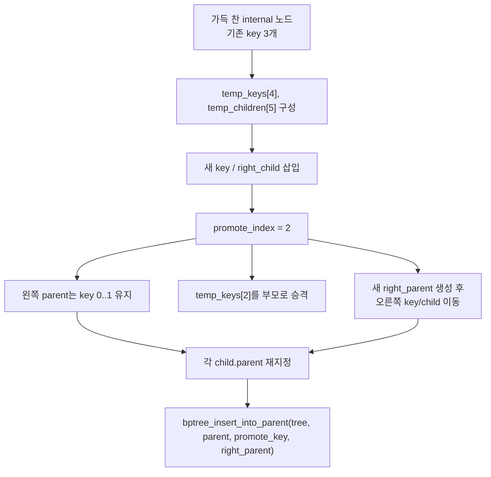
```mermaid
flowchart TD
    FullParent["가득 찬 internal 노드<br/>기존 key 3개"] --> TempBuild["temp_keys[4], temp_children[5] 구성"]
    TempBuild --> InsertNew["새 key / right_child 삽입"]
    InsertNew --> PromoteIndex["promote_index = 2"]
    PromoteIndex --> LeftKeep["왼쪽 parent는 key 0..1 유지"]
    PromoteIndex --> PromoteKey["temp_keys[2]를 부모로 승격"]
    PromoteIndex --> RightMake["새 right_parent 생성 후<br/>오른쪽 key/child 이동"]
    LeftKeep --> FixParent["각 child.parent 재지정"]
    RightMake --> FixParent
    FixParent --> Up["bptree_insert_into_parent(tree, parent, promote_key, right_parent)"]
```

승격 전파 시나리오:

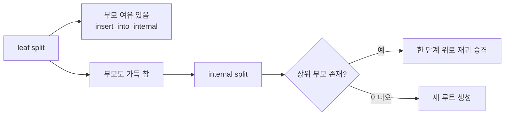
```mermaid
flowchart LR
    LeafSplit["leaf split"] --> ParentInsert["부모 여유 있음<br/>insert_into_internal"]
    LeafSplit --> ParentFull["부모도 가득 참"]
    ParentFull --> InternalSplit["internal split"]
    InternalSplit --> GrandParent{"상위 부모 존재?"}
    GrandParent -->|"예"| Recurse["한 단계 위로 재귀 승격"]
    GrandParent -->|"아니오"| NewRoot["새 루트 생성"]
```

핵심 해석:

- split은 leaf에서 끝나지 않고 부모 overflow 여부에 따라 루트까지 연쇄 전파된다.
- 상위 부모가 없으면 `bptree_create_new_root()`가 호출되어 트리 높이가 증가한다.

관련 코드:

- `bptree.c:85-143`
- `bptree.c:202-269`

## 15. 순차 삽입 `1..10` 후 B+ 트리 스냅샷

`BPTREE_ORDER = 4`에서 `1`부터 `10`까지 순차 삽입되면, 현재 구현 로직상 트리는 아래와 같은 형태가 된다.

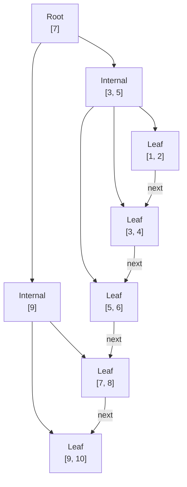
```mermaid
flowchart TD
    Root["Root<br/>[7]"]

    LeftInternal["Internal<br/>[3, 5]"]
    RightInternal["Internal<br/>[9]"]

    L1["Leaf<br/>[1, 2]"]
    L2["Leaf<br/>[3, 4]"]
    L3["Leaf<br/>[5, 6]"]
    L4["Leaf<br/>[7, 8]"]
    L5["Leaf<br/>[9, 10]"]

    Root --> LeftInternal
    Root --> RightInternal

    LeftInternal --> L1
    LeftInternal --> L2
    LeftInternal --> L3

    RightInternal --> L4
    RightInternal --> L5

    L1 -->|"next"| L2
    L2 -->|"next"| L3
    L3 -->|"next"| L4
    L4 -->|"next"| L5
```

핵심 해석:

- `unit_test.c`의 `test_internal_split_new_root()`가 검증하는 트리 높이 증가는 이와 같은 구조를 만든다.
- 루트는 separator key 하나만 들고, 실제 값 포인터는 모든 leaf에만 남아 있다.

관련 코드:

- `unit_test.c:69-90`
- `bptree.c:147-269`

## 16. 메모리 소유권과 해제 순서

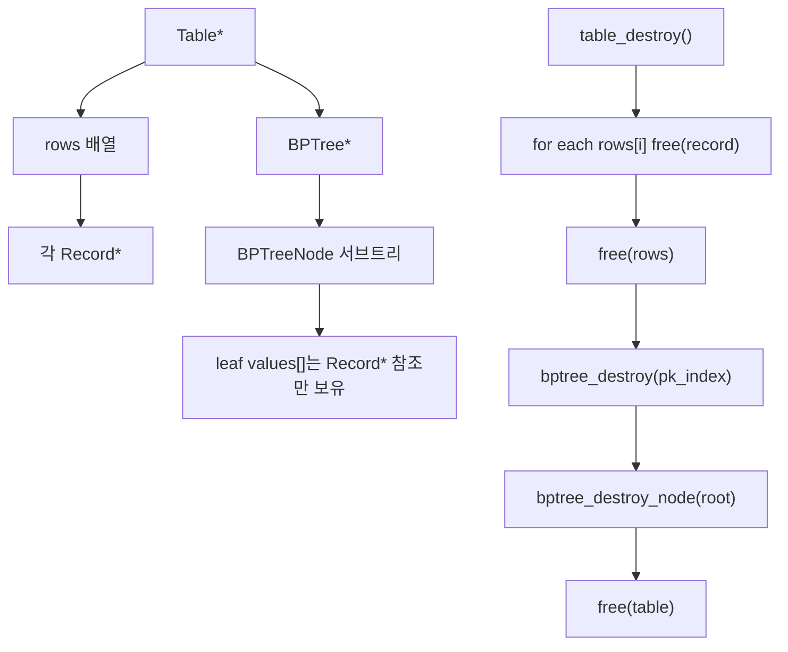
```mermaid
flowchart TD
    Table["Table*"] --> Rows["rows 배열"]
    Table --> Index["BPTree*"]
    Rows --> Record["각 Record*"]
    Index --> Nodes["BPTreeNode 서브트리"]
    Nodes --> Ptrs["leaf values[]는 Record* 참조만 보유"]

    Destroy["table_destroy()"] --> FreeRecords["for each rows[i] free(record)"]
    FreeRecords --> FreeRows["free(rows)"]
    FreeRows --> DestroyTree["bptree_destroy(pk_index)"]
    DestroyTree --> DestroyNodes["bptree_destroy_node(root)"]
    DestroyNodes --> FreeTable["free(table)"]
```

핵심 해석:

- 레코드 해제는 반드시 `Table` 쪽에서 먼저 한다.
- 트리는 노드 메모리만 해제하고 `Record*`는 해제하지 않는다.
- 이 설계 덕분에 중복 해제를 피할 수 있다.

관련 코드:

- `table.c:48-61`
- `bptree.c:52-67`
- `bptree.c:278-285`

## 17. 테스트 커버리지 맵

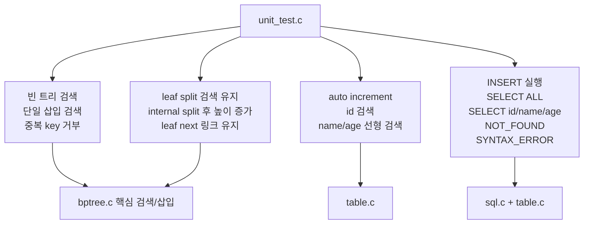
```mermaid
flowchart TB
    Tests["unit_test.c"] --> TreeBasics["빈 트리 검색<br/>단일 삽입 검색<br/>중복 key 거부"]
    Tests --> TreeSplit["leaf split 검색 유지<br/>internal split 후 높이 증가<br/>leaf next 링크 유지"]
    Tests --> TableBasics["auto increment<br/>id 검색<br/>name/age 선형 검색"]
    Tests --> SQLExec["INSERT 실행<br/>SELECT ALL<br/>SELECT id/name/age<br/>NOT_FOUND<br/>SYNTAX_ERROR"]

    TreeBasics --> BPTree["bptree.c 핵심 검색/삽입"]
    TreeSplit --> BPTree
    TableBasics --> Table["table.c"]
    SQLExec --> SQL["sql.c + table.c"]
```

추가 해석:

- 현재 테스트는 기능 happy path와 주요 split path를 잘 덮는다.
- 아직 없는 검증:
  - 메모리 할당 실패 경로
  - 비정상적으로 긴 식별자/문자열 입력
  - `SELECT * FROM users WHERE unknown = ...` 같은 세부 파싱 edge case
  - 대량 랜덤 삽입 시 구조적 불변성 점검

관련 코드:

- `unit_test.c:9-236`

## 18. 성능 벤치마크 흐름

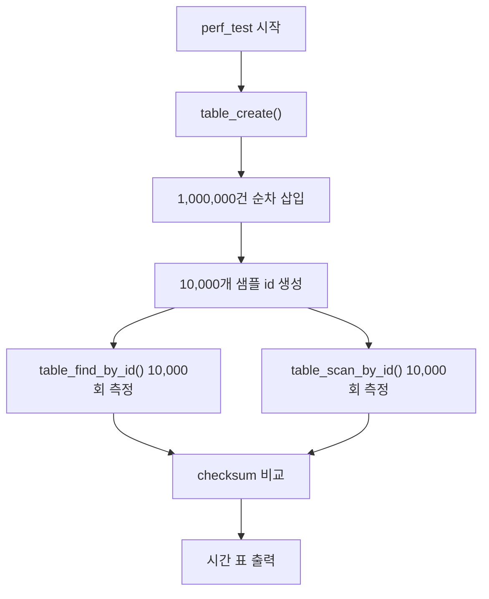
```mermaid
flowchart TD
    Start["perf_test 시작"] --> Create["table_create()"]
    Create --> Build["1,000,000건 순차 삽입"]
    Build --> Samples["10,000개 샘플 id 생성"]
    Samples --> Indexed["table_find_by_id() 10,000회 측정"]
    Samples --> Linear["table_scan_by_id() 10,000회 측정"]
    Indexed --> Checksum["checksum 비교"]
    Linear --> Checksum
    Checksum --> Report["시간 표 출력"]
```

실측 결과:

| 날짜 | Inserted Rows | Indexed Search | Linear Search | Speedup |
| --- | ---: | ---: | ---: | ---: |
| 2026-04-15 | 1,000,000 | 9.913 ms | 12353.667 ms | 1246.20x |

핵심 해석:

- 이 프로젝트의 핵심 메시지는 `id` 인덱스 검색과 선형 검색의 차이를 아주 직관적으로 보여주는 데 있다.
- 현재 구현은 순차 삽입 시에도 split을 올바르게 전파하면서 검색 속도 이점을 유지한다.

관련 코드:

- `perf_test.c:27-100`

## 19. 실제 데모 실행 흐름 요약

아래는 `2026-04-15`에 실제로 실행한 샘플 세션을 축약한 것이다.

```text
INSERT INTO users VALUES ('Alice', 20);  -> Inserted row with id = 1
INSERT INTO users VALUES ('Bob', 30);    -> Inserted row with id = 2
SELECT * FROM users;                     -> Alice, Bob 모두 출력
SELECT * FROM users WHERE id = 1;        -> Alice 출력
SELECT * FROM users WHERE name = 'Bob';  -> Bob 출력
SELECT * FROM users WHERE age = 20;      -> Alice 출력
```

이 흐름은 위 다이어그램 5, 8, 9, 10이 실제로 어떻게 연결되는지 보여주는 런타임 예시다.

## 20. 발표용 핵심 한 줄 정리

- 이 프로젝트는 `고정 문법 SQL 파서 -> 테이블 레이어 -> B+ 트리 인덱스`로 이어지는 교육용 미니 DB 파이프라인이다.
- `id`는 인덱스, `name/age`는 선형 탐색이라는 대비가 구조와 성능 차이를 가장 선명하게 드러낸다.
- 발표 시에는 다이어그램 1, 8, 13, 15, 18 순으로 설명하면 전체 구조와 성능 메시지가 가장 빠르게 전달된다.
