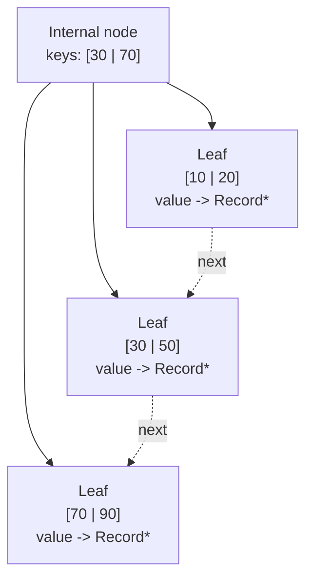
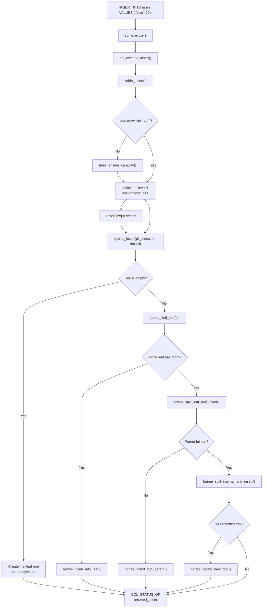
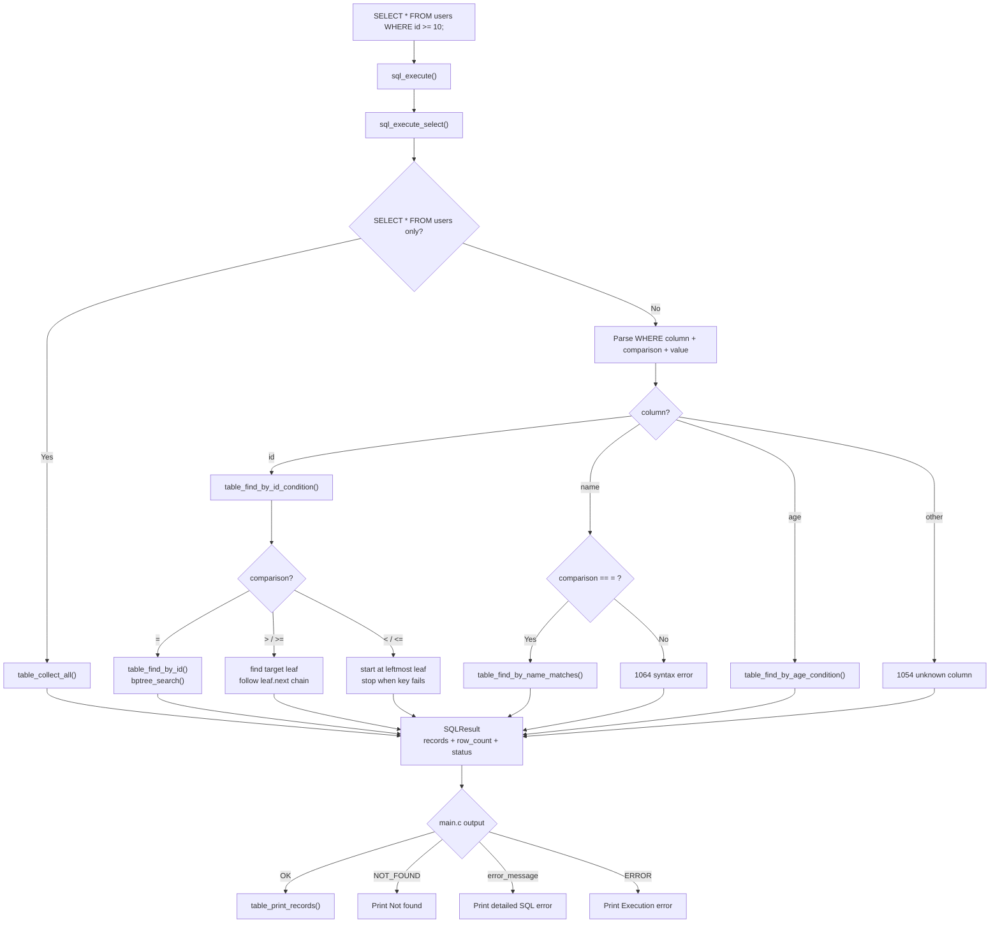
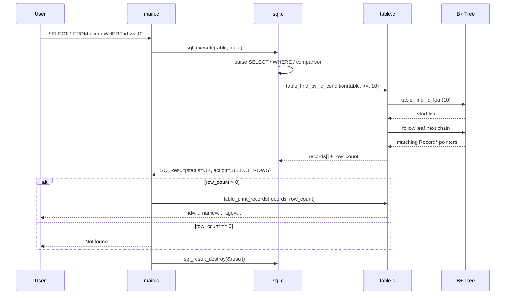

# Simple SQL Processor with B+ Tree Index

메모리 기반 `users` 테이블에 대해 아주 작은 SQL 처리기와 B+ 트리 인덱스를 구현한 MVP 프로젝트입니다. 목표는 복잡한 DBMS 기능보다 `동작하는 인덱스`, `설명 가능한 split`, `ID 조건 검색 성능 비교`에 집중하는 것입니다.

## 1. B+ 트리 구조 설명

### 전체 시스템 흐름

```mermaid
flowchart LR
    User["User"]
    REPL["main.c\nREPL loop"]
    Exec["sql_execute()"]
    Insert["sql_execute_insert()"]
    Select["sql_execute_select()"]
    TableInsert["table_insert()"]
    Rows["Table.rows\nRecord* array"]
    Tree["B+ Tree\npk_index"]
    CollectAll["table_collect_all()"]
    IdCond["table_find_by_id_condition()"]
    NameCond["table_find_by_name_matches()"]
    AgeCond["table_find_by_age_condition()"]
    Result["SQLResult\nstatus + action + records"]
    Print["table_print_records()"]
    Feedback["Inserted row / rows / Not found /\nDetailed SQL error / Execution error"]

    User --> REPL --> Exec
    Exec -->|INSERT| Insert --> TableInsert
    TableInsert --> Rows
    TableInsert -->|bptree_insert()| Tree

    Exec -->|SELECT| Select
    Select -->|SELECT *| CollectAll --> Result
    Select -->|WHERE id ...| IdCond --> Tree
    Select -->|WHERE name = ...| NameCond --> Rows
    Select -->|WHERE age ...| AgeCond --> Rows

    Tree --> Result
    Rows --> Result
    Result --> REPL
    REPL --> Print --> Feedback --> User
```

Mermaid source: `docs/diagrams/system-context.mmd`

### B+ 트리 노드 관계



Mermaid source: `docs/diagrams/bptree-overview.mmd`

- 내부 노드: 검색 경로를 안내하는 key와 child pointer만 저장
- 리프 노드: 실제 `(key, value)`를 저장
- value는 `Record *`
- 리프 노드끼리는 `next` 포인터로 연결

이 프로젝트에서는 `order = 4`를 사용합니다.

- 한 노드의 최대 key 수: `3`
- key가 `4개`가 되면 split 발생

## 2. 구현 범위

### 포함

- 메모리 기반 B+ 트리
- `insert(key=id, value=record pointer)`
- `search(key)`
- leaf node 연결 리스트
- leaf split / internal split
- 고정 스키마 `users(id, name, age)`
- `INSERT INTO users VALUES ('Alice', 20);`
- `SELECT * FROM users;`
- `SELECT * FROM users WHERE id = 1;`
- `SELECT * FROM users WHERE id >= 10;`
- `SELECT * FROM users WHERE name = 'Alice';`
- `SELECT * FROM users WHERE age = 20;`
- `SELECT * FROM users WHERE age > 20;`
- `id` 자동 증가
- `SELECT *` 기반 전체 조회
- `WHERE id` 는 `=`, `<`, `<=`, `>`, `>=`를 B+ 트리와 leaf link로 처리
- `WHERE age` 는 `=`, `<`, `<=`, `>`, `>=`를 선형 탐색으로 처리
- `WHERE name` 은 `=`만 지원
- MySQL 스타일 상세 SQL 오류 메시지 일부 흉내내기

### 제외

- DELETE, UPDATE
- 디스크 저장
- JOIN, GROUP BY
- 범용 SQL 파서
- `SELECT age FROM users;` 같은 projection
- `name` 컬럼 인덱스

## 3. 파일 구성

- `bptree.h`, `bptree.c`: B+ 트리 핵심 구조와 insert/search/split
- `table.h`, `table.c`: 레코드 저장과 인덱스 연동
- `sql.h`, `sql.c`: 고정 패턴 SQL 파서/실행기와 상세 오류 메시지 생성
- `main.c`: 데모용 REPL
- `perf_test.c`: 100만 건 insert 후 ID 검색 속도 비교
- `condition_perf_test.c`: `WHERE id ...` 와 `WHERE age ...` 조건 성능 비교
- `unit_test.c`: assert 기반 단위 테스트
- `docs/diagrams/*.mmd`: README용 Mermaid 소스
- `Makefile`: 빌드 스크립트

## 4. 빌드 및 실행 방법

```bash
make
./main
./unit_test
./perf_test
./condition_perf_test
```

## 5. SQL 예시

```sql
INSERT INTO users VALUES ('Alice', 20);
INSERT INTO users VALUES ('Bob', 30);

SELECT * FROM users;
SELECT * FROM users WHERE id = 1;
SELECT * FROM users WHERE id >= 2;
SELECT * FROM users WHERE name = 'Bob';
SELECT * FROM users WHERE age = 20;
SELECT * FROM users WHERE age > 20;
```

예상 출력:

```text
Inserted row with id = 1
Inserted row with id = 2
id=1, name='Alice', age=20
id=2, name='Bob', age=30
id=1, name='Alice', age=20
id=2, name='Bob', age=30
id=2, name='Bob', age=30
id=1, name='Alice', age=20
id=2, name='Bob', age=30
```

### INSERT 처리 흐름



Mermaid source: `docs/diagrams/insert-flow.mmd`

### SELECT 처리 흐름



Mermaid source: `docs/diagrams/select-id-flow.mmd`

### `WHERE id >= ...` 시퀀스 다이어그램



Mermaid source: `docs/diagrams/query-sequence.mmd`

## 6. 오류 처리

현재 `main.c`는 `SQLResult`를 받아 아래 순서로 출력합니다.

- 성공이면 `Inserted row ...` 또는 `table_print_records()` 결과 출력
- 결과 행이 없으면 `Not found`
- `error_message`가 채워져 있으면 그 상세 오류를 그대로 출력
- 상세 오류가 없고 문법만 틀렸다면 `Syntax error`
- 내부 메모리 실패 등은 `Execution error`

### 6-1. 상세 SQL 오류 예시

대부분의 잘못된 입력은 단순한 `Syntax error` 대신 MySQL 스타일의 상세 메시지로 변환됩니다.

```sql
SELECT * FORM users;
SELECT age FROM users;
SELECT nickname FROM users;
SELECT * FROM users WHERE nickname = 1;
SELECT * FROM users WHERE name > 'Alice';
```

대표 출력 예시는 아래와 같습니다.

```text
ERROR 1064 (42000): ... near 'FORM users' at line 1
ERROR 1064 (42000): ... near 'age FROM users' at line 1
ERROR 1054 (42S22): Unknown column 'nickname' in 'field list'
ERROR 1054 (42S22): Unknown column 'nickname' in 'where clause'
ERROR 1064 (42000): ... near '> 'Alice'' at line 1
```

핵심 규칙은 다음과 같습니다.

- `SELECT *` 외 projection은 아직 지원하지 않음
- `id`, `name`, `age` 외 컬럼은 `Unknown column` 처리
- `name` 컬럼은 `=`만 지원하고 `>`, `<`는 문법 오류 처리

### 6-2. `Not found`

문장은 정상인데 조건에 맞는 데이터가 없으면 `Not found`가 출력됩니다.

```sql
SELECT * FROM users WHERE id = 999;
SELECT * FROM users WHERE name = 'Charlie';
```

```text
Not found
```

### 6-3. `No rows`

전체 조회 자체는 성공했지만 아직 아무 데이터도 넣지 않았다면 `No rows`가 출력됩니다.

```sql
SELECT * FROM users;
```

```text
No rows
```

### 6-4. `Execution error`

이 메시지는 사용자가 문장을 잘못 쳤을 때보다, 프로그램 내부에서 메모리 할당 같은 실행 문제가 생겼을 때 출력됩니다. 일반적인 데모 상황에서는 보기 어렵지만, `table_insert`, `table_collect_all`, `table_find_by_*_condition` 같은 내부 함수가 실패하면 이 경로로 들어갑니다.

## 7. 핵심 로직 설명: split 과정

### leaf split

리프 노드가 가득 찬 상태에서 새 key가 들어오면, 기존 key와 새 key를 정렬된 임시 배열에 모은 뒤 `2 | 2`로 나눕니다.

```text
기존 leaf: [10 | 20 | 30]
40 삽입:   [10 | 20 | 30 | 40]

split 후:
왼쪽 leaf  = [10 | 20]
오른쪽 leaf = [30 | 40]

부모로 올리는 key = 30
```

### internal split

내부 노드가 overflow 되면 가운데 separator key를 부모로 올리고, 왼쪽/오른쪽 child 집합을 분리합니다.

```text
임시 key: [10 | 20 | 30 | 40]

왼쪽 internal  = [10 | 20]
부모로 승격    = 30
오른쪽 internal = [40]
```

핵심 아이디어는 다음과 같습니다.

- 실제 데이터 포인터는 리프에만 저장
- 부모는 오른쪽 서브트리의 시작 key를 관리
- split이 루트까지 전파되면 새 루트가 생성됨

## 8. 성능 테스트 방법

- `1,000,000`건 순차 insert
- `10,000`건 ID 검색 샘플
- 비교 대상
  - B+ 트리 기반 `table_find_by_id`
  - 선형 탐색 기반 `table_scan_by_id`
- 시간 측정은 `gettimeofday()` 사용

조건 비교 벤치마크는 `./condition_perf_test` 로 실행할 수 있습니다.

- `WHERE id = ?` 와 `WHERE age = ?` 반복 비교
- `WHERE id >= 990001` 와 `WHERE age >= 99` 반복 비교
- 두 range query는 모두 쿼리당 `10,000`건을 반환하도록 맞춰 둠

| Inserted Rows | B+ Tree Search Time (ms) | Linear Search Time (ms) | Speedup |
| --- | ---: | ---: | ---: |
| 1,000,000 | 10.104 | 13119.946 | 1298.49x |

## 9. 발표용 핵심 포인트

- 내부 노드는 "길 안내판", 리프 노드는 "실제 데이터 보관소"입니다.
- `id`는 B+ 트리 인덱스를 쓰므로 빠르게 내려가서 찾고, `>`/`>=`는 리프 링크를 따라가며 확장합니다.
- `age`, `name`은 보조 인덱스가 없어서 rows 배열을 직접 훑습니다.
- SQL 실행 결과는 `SQLResult` 하나로 묶어서 `main.c`가 출력 책임을 가집니다.
- 핵심 구현 포인트는 `leaf split`, `internal split`, `새 루트 생성`, `조건별 다른 검색 경로`입니다.
